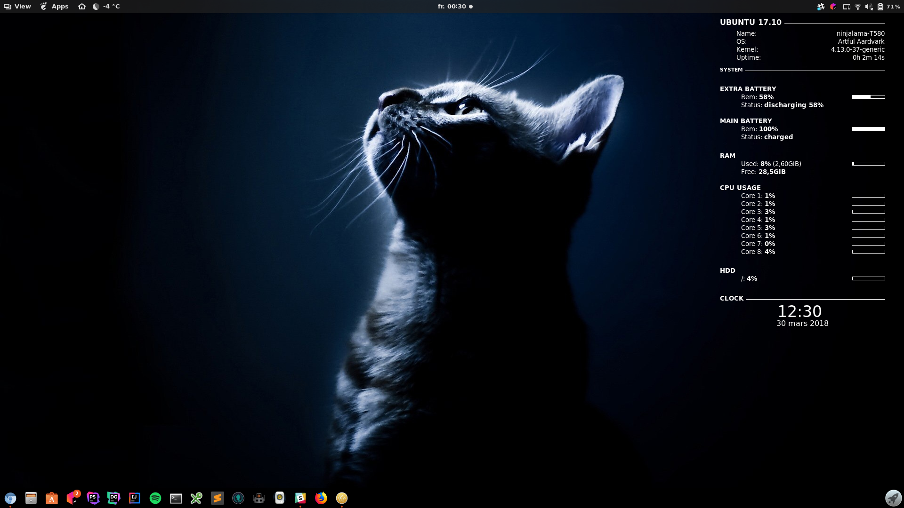

# Conky configuration
This is the [conky](https://github.com/brndnmtthws/conky) configuration I use, which results in what you see in the screenshot below.

## Installation

### Step 1 - Fetch the config
`$ git clone git://github.com/ninjalama/conky ~/.conky`

### Step 2 - Tweak the config
My current conky config is a bit hard-coded (and partially based on other conky config examples I've found online). To make it work for you, you probably want to edit a couple of things in the config file.

### Step 3 - Make conky use your config-file
There are several ways to make conky use your config file. The easiest way is to explicitly tell conky to use it, e.g:
`$ conky -c ~/.conky/conky.conf`

Personally, I'd put the config file, or a symlink, in the `~/.config/conky/` directory. Then, whenever you run the `conky` command, your conky config file will be used by default.
